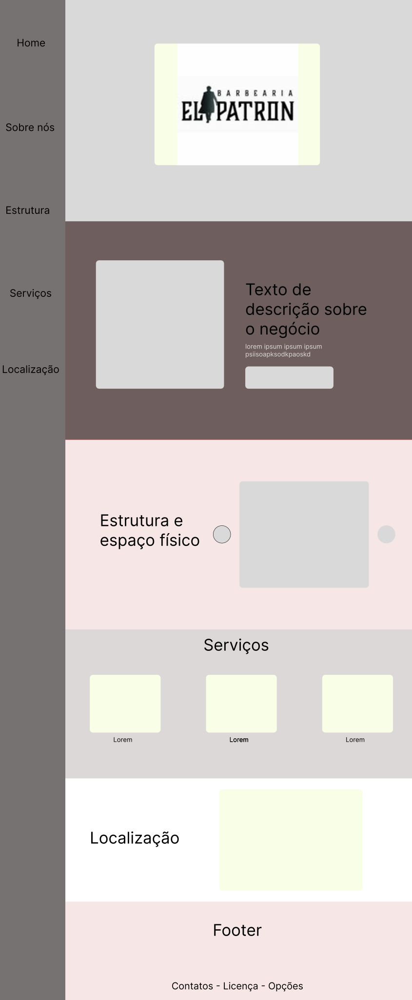
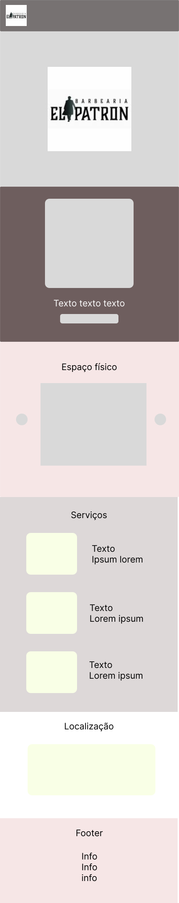

# El Patron - Barbearia

Projeto desenvolvido para a disciplina de **Desenvolvimento Web Mobile**.

---

## Integrantes

| Nome | RA |
|------|----|

| Gustavo Garabetti Munhoz | 10409258 |
| João Pedro Rodrigues Vieira | 10403595 |
| Joaquim Rafael Mariano Prieto Pereira | 10408805 |
| Caio Yukio Yazawa | 10418604 |
| Erick Guilherme de Macedo Cabral | 10419996 |

---

## Processo de Ideação

O processo de ideação foi conduzido de forma colaborativa, com participação ativa de todos os integrantes do grupo. Cada membro apresentou uma proposta de negócio para ser o foco do projeto:

| Integrante | Proposta |
|------------|----------|

| João Pedro | Hortifruti |
| Gustavo | Barbearia |
| Caio | Rede de supermercados Shibata |
| Joaquim | Loja de joias |

Para selecionar a proposta mais adequada, o grupo avaliou cada alternativa com base nos seguintes critérios:

| Critério | Descrição |
|----------|-----------|

| Necessidade real | O negócio possui uma lacuna digital identificada e concreta? |
| Viabilidade técnica | O escopo é compatível com uma landing page no tempo da disciplina? |
| Acesso para validação | É possível interagir com o estabelecimento para validar decisões de design? |
| Impacto extensionista | Há benefício claro para um empreendedor ou comunidade local? |

A **Barbearia El Patron** se destacou em todos os critérios: o estabelecimento não possui site nem presença digital estruturada, o proprietário está acessível para validações, e a solução tem escopo bem delimitado — uma landing page com informações, galeria e localização. As demais propostas foram descartadas por apresentarem menor viabilidade extensionista (loja de joias), escopo excessivamente amplo (rede de supermercados Shibata) ou necessidade digital menos urgente (hortifruti).

O projeto visa, portanto, desenvolver uma solução web/mobile que preencha essa lacuna, proporcionando uma experiência mais moderna e acessível tanto para o negócio quanto para seus clientes.

---

## Caráter Extensionista

O projeto apoia o proprietário da **Barbearia El Patron**, um pequeno empreendedor local sem recursos para contratar desenvolvimento de software e sem tempo para construir presença digital por conta própria.

O impacto, porém, vai além do negócio atendido:

- **Para os clientes**: moradores do bairro e região passam a ter acesso fácil aos serviços, localização e contato da barbearia — reduzindo a dependência de indicações boca a boca e facilitando o agendamento.
- **Para o empreendedor**: a presença digital estruturada amplia o alcance do negócio, podendo atrair novos clientes e contribuir para o crescimento sustentável da barbearia.
- **Para a comunidade local**: apoiar a digitalização de pequenos negócios contribui para a valorização do comércio local e o fortalecimento da economia do bairro, mostrando que a tecnologia pode ser um instrumento de inclusão e desenvolvimento comunitário.

Dessa forma, o projeto vai além do ambiente acadêmico, conectando aprendizado técnico com responsabilidade social concreta e mensurável.

---

## Protótipo — Wireframes

Os wireframes apresentam o layout de **sidebar + conteúdo**, as seções são, de cima para baixo:

| Seção | O que apresenta |
| --- | --- |
| **Home** | Logo da barbearia em destaque centralizado |
| **Sobre Nós** | Card com imagem e texto lado a lado, finalizando com botão de ação |
| **Estrutura** | Carrossel com botões de navegação lateral, exibindo uma foto por vez |
| **Serviços** | Três cards dispostos horizontalmente, cada um com imagem e descrição |
| **Localização** | Endereço e mapa embarcado via iframe |
| **Footer** | Links de navegação e informações de contato |

### Desktop



### Mobile



## Tutorial - `index.html`

```html
O header, em mobile, contém o logo da barbearia e uma navbar com as seções da landing page.
<body>
    <header>
        
        <nav>
            <ul>
                <li><a href="#home">Home</a></li>
                <li><a href="#about">Sobre nós</a></li>
                <li><a href="#structure">Estrutura</a></li>
                <li><a href="#services">Serviços</a></li>
                <li><a href="#localization">Localização</a></li>
            </ul>
        </nav>
    </header>
```

```html
Na home, temos uma seção com apenas o logo da barbearia em destaque no centro.
    <main>
        <section id="home">
            
        </section>
```

```html
Na seguinte seção, explicitamos as informações gerais da barbearia, contendo uma imagem representativa, um subtitulo, a explicação em parágrafo e um botão para saber mais.
        <section id="about">
            
            <h2>Sobre nós</h2>
            <p>Lorem ipsum dolor sit amet consectetur adipisicing elit. Consectetur dolorum nihil dolor numquam provident officiis? Magni ab laudantium quas deserunt error soluta. At maiores ratione inventore animi exercitationem laboriosam. Repudiandae.</p>
            <button type="button">botao</section>
        </section>
```

```html
Nesta seção, temos um carrossel interativo dos melhores cortes da barbearia. Inserimos 3 imagens para representar isso, mas é possível inserir mais. Além disso, dois botões laterais para controlar o carrossel, movendo ele pra direita e esquerda.
        <section id="structure">
            <h2>Estrutura e espaço físico</h2>
            <button type="button">botao</button>
            <figure></figure>
            <figure></figure>
            <figure></figure>
            <button type="button">botao</button>
        </section>
```

```html
Esta seção contém uma seção com alguns artigos para mostrar os valores da barbearia.
        <section id="services">
            <h2>Serviços</h2>
            <section>
                <article>
                    
                    <h3>Titulo</h3>
                    <p>Lorem ipsum dolor sit amet consectetur adipisicing elit. Iste magni fugit placeat maiores vero aspernatur, sit, voluptatibus est id, odit quia perferendis! Veritatis deleniti odio molestiae ea obcaecati non perferendis?</p>
                </article>
                <article>
                    
                    <h3>Titulo</h3>
                    <p>Lorem ipsum dolor sit amet consectetur adipisicing elit. Iste magni fugit placeat maiores vero aspernatur, sit, voluptatibus est id, odit quia perferendis! Veritatis deleniti odio molestiae ea obcaecati non perferendis?</p>
                </article>
                <article>
                    
                    <h3>Titulo</h3>
                    <p>Lorem ipsum dolor sit amet consectetur adipisicing elit. Iste magni fugit placeat maiores vero aspernatur, sit, voluptatibus est id, odit quia perferendis! Veritatis deleniti odio molestiae ea obcaecati non perferendis?</p>
                </article>
            </section>
        </section>
```

```html
Aqui, teremos a localização geográfica da barbearia. Pretendemos fazer algo mais elaborado, mas por enquanto temos apenas um iFrame.
        <section id="localization">
            <h2>Localização</h2>
            <address>Rua da consolação</address>
            <iframe src="https://encrypted-tbn0.gstatic.com/images?q=tbn:ANd9GcSPzU4Bt3ZqZz5LnDqvom_yVLkCvjPK4JjUsw&s" title="Mapa"></iframe>
        </section>
    </main>
```

```html
No footer, temos referências para as outras seções da landing page e possíveis informações de contato.
    <footer>
        <ul>
            <li><a href="#home">Home</a></li>
            <li><a href="#about">Sobre nós</a></li>
            <li><a href="#structure">Estrutura</a></li>
            <li><a href="#services">Serviços</a></li>
            <li><a href="#localization">Localização</a></li>
            <li><a href="tel:+">999999999999</a></li>
            <li><a href="http://">Instagram</a></li>
        </ul>
    </footer>
</body>
</html>
```

```css

Seguindo com as abas ABOUT, STRUCTURE, SERVICES e LOCATION, continuamos com a verticalização da aba, alinhando os itens no centro e colocando uma cor de fundo.
#about {
  display: flex;
  flex-direction: column;
  gap: 1rem;
}

#about img {
  width: 100%;
  object-fit: cover;
}

#about button {
  align-self: flex-end;
  padding: 0.5rem 1.5rem;
  cursor: pointer;
}

#structure {
  display: flex;
  flex-direction: column;
  align-items:center;
}

#structure ul {
  display: flex;
}

#structure figure img {
  width: 100%;
  object-fit: cover;
}

#structure > button {
  background-color: red;
  cursor: pointer;
}

#structure > div {
  display:flex;
}

#services > section {
  display: flex;
  flex-direction: column;
  gap: 1.5rem;
  padding: 0;
}

#services article {
  display: flex;
  flex-direction: column;
  gap: 0.5rem;
}

#services article img {
  width: 100%;
  object-fit: cover;
}

#localization {
  display: flex;
  flex-direction: column;
  gap: 1rem;
}

#localization iframe {
  width: 100%;
  min-height: 300px;
  border: none;
}
```

---

## Tutorial — `style.css`

O arquivo `style.css` é responsável por toda a estilização visual da landing page da **El Patron**. Ele está organizado em blocos correspondentes a cada seção do HTML, além de uma camada de responsividade via media query.

---

### Reset Global

```css
* {
  margin: 0;
  padding: 0;
  box-sizing: border-box;
  font-family: -apple-system, BlinkMacSystemFont, "Helvetica Neue", "Helvetica", "Arial", sans-serif;
}
```

Remove margens e paddings padrão de todos os elementos, adota `border-box` para facilitar o cálculo de dimensões e define a fonte base do projeto com fallback para fontes do sistema.

Adicionalmente:

- `html` tem `overflow-x: hidden` — impede o elemento raiz de expandir além do viewport e evitar a linha/faixa lateral que surge quando algum elemento transborda horizontalmente.
- `ul` tem `list-style: none` — remove marcadores das listas de navegação e footer.
- `a` tem `text-decoration: none` e `color: inherit` — links sem sublinhado, herdando a cor do elemento pai.
- `img` tem `max-width: 100%` e `display: block` — imagens responsivas e sem espaço extra embaixo.

---

### Header

```css
header {
  display: flex;
  align-items: center;
  padding: 1rem;
}
```

Em **mobile**, o header é uma barra horizontal (`flex` em linha) contendo o logo (48×48 px) e a navbar. `justify-content: space-between` separa logo e nav, com `gap: 1.5rem` como espaço mínimo entre eles. Os itens da navegação usam `flex-wrap: wrap` para quebrar linha quando necessário.

---

### Main

```css
main {
  display: flex;
  flex-direction: column;
}
```

O `<main>` empilha todas as seções verticalmente em mobile.

---

### Seções — espaçamento padrão

```css
section {
  padding: 2rem 1rem;
}
section h2 {
  margin-bottom: 1rem;
}
```

Toda seção recebe espaçamento interno padrão. Os títulos `h2` têm margem inferior para separar o cabeçalho do conteúdo.

---

### `#home` — Hero

```css
#home {
  display: flex;
  justify-content: center;
  align-items: center;
  min-height: 60vh;
}
#home img {
  max-height: 200px;
  object-fit: contain;
}
```

Seção de destaque que ocupa pelo menos 60% da altura da viewport. O logo central tem altura máxima de 200 px e é centralizado horizontal e verticalmente.

---

### `#about` — Sobre Nós

```css
.about-article-card {
  display: grid;
  grid-template-rows: auto 1fr;
  gap: 1.5rem;
}
.about-article-card img {
  width: 100%;
  object-fit: cover;
}
.about-text-box {
  display: flex;
  flex-direction: column;
  gap: 0.5rem;
}
```

Em mobile, o card usa `display: grid` com `grid-template-rows: auto 1fr` — a imagem ocupa seu tamanho natural e `.about-text-box` preenche a altura restante. Isso permite que `justify-content: space-between` no text-box posicione o botão no rodapé do card.

---

### `#structure` — Estrutura / Galeria

```css
#structure {
  display: flex;
  flex-direction: column;
  align-items: center;
}
#structure ul {
  display: flex;
}
#structure figure img {
  width: 100%;
  object-fit: cover;
}
#structure > button {
  border-radius: 9999px;
  cursor: pointer;
}
```

Galeria de fotos. Os cards do carrossel são dispostos em linha (`flex`). Os botões de navegação do carrossel são circulares (raio de borda `9999px`).

---

### `#services` — Serviços

```css
#services > section {
  display: flex;
  flex-direction: column;
  gap: 1.5rem;
  padding: 0;
}
#services article {
  display: flex;
  align-items: center;
  gap: 0.5rem;
}
#services article img {
  width: 100%;
  object-fit: cover;
}
```

Em mobile, os cards de serviço são empilhados verticalmente. Cada `<article>` exibe imagem e texto lado a lado (`align-items: center`).

---

### `#localization` — Localização

```css
#localization {
  display: flex;
  flex-direction: column;
  gap: 1rem;
  align-items: center;
}
#localization iframe {
  width: 100%;
  min-height: 300px;
  border: none;
}
```

Seção exibindo endereço e mapa via `<iframe>`. O mapa ocupa 100% da largura disponível com altura mínima de 300 px e sem borda.

---

### Footer

```css
footer {
  padding: 2rem 1rem;
}
footer ul {
  display: flex;
  flex-wrap: wrap;
  gap: 1rem;
  justify-content: center;
}
```

Rodapé com links centralizados e distribuídos com `flex-wrap`, permitindo que quebrem linha em telas pequenas.

---

### Responsividade — Desktop (`min-width: 768px`)

A partir de **768 px** de largura, o layout muda de mobile-first para uma estrutura de sidebar + conteúdo:

| Elemento | Comportamento em desktop |
|----------|--------------------------|

| `body > div` | `display: flex` — coloca header e main lado a lado |
| `header` | Torna-se sidebar vertical com `height: 100vh`; nav centralizada com `margin: auto 0` |
| `nav > ul` | Itens da nav empilhados em coluna |
| `section` | Padding aumentado para `3rem 2rem` |
| `#about` | Card muda para `grid-template-columns: 1fr 1fr` — imagem e texto lado a lado com mesma altura |
| `#structure li` | Cada card ocupa `flex: 0 0 30%`, cabendo mais fotos por linha |
| `.carrousel-list` | Recebe `flex: 1` para ocupar o espaço entre os botões e `justify-content: center` para centralizar a foto visível |
| `#services > section` | Cards de serviço em linha (`flex-direction: row`) com cada article em coluna |
| `#localization` | Endereço e mapa ficam lado a lado (`flex-direction: row`) |

---

## Tutorial — `script.js`

### Carrossel interativo

O carrossel da seção `#structure` é controlado por duas funções JavaScript. A lógica se baseia em um único elemento com `id="visible"` — apenas o `<li>` marcado com esse id é exibido (via CSS `display: flex`); todos os outros ficam ocultos (`display: none`).

```js
function carrouselLeftClick() {
  const imagesList = document.getElementsByClassName("carrousel-list")[0];
  const elements = imagesList.getElementsByTagName("li");

  let currIndex = Array.from(elements).findIndex((el) => el.id == "visible");

  elements[currIndex].removeAttribute("id");
  elements[
    (((currIndex - 1) % elements.length) + elements.length) % elements.length
  ].id = "visible";
}
```

`carrouselLeftClick` navega para a foto anterior. O cálculo `(((currIndex - 1) % n) + n) % n` garante que o índice faça wrap circular mesmo quando `currIndex` é `0` (evitando índice negativo em JavaScript).

```js
function carrouselRightClick() {
  const imagesList = document.getElementsByClassName("carrousel-list")[0];
  const elements = imagesList.getElementsByTagName("li");

  let currIndex = Array.from(elements).findIndex((el) => el.id == "visible");
  elements[currIndex].removeAttribute("id");
  elements[(currIndex + 1) % elements.length].id = "visible";
}
```

`carrouselRightClick` navega para a foto seguinte com wrap circular simples via módulo.

Em ambas as funções o fluxo é:

1. Localizar o `<li id="visible">` atual pelo índice.
2. Remover o `id="visible"` dele.
3. Calcular o novo índice (anterior ou próximo, com wrap).
4. Atribuir `id="visible"` ao novo `<li>`, tornando-o visível.
